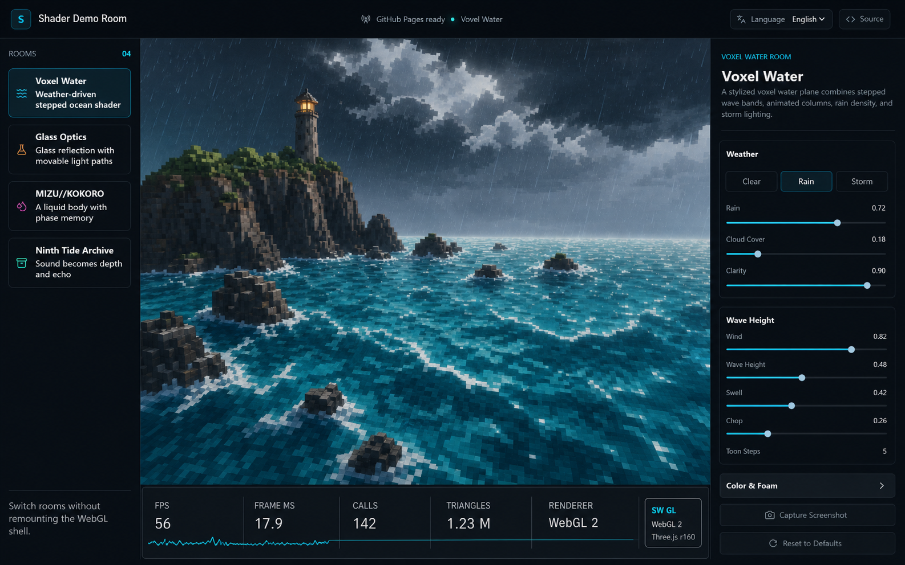
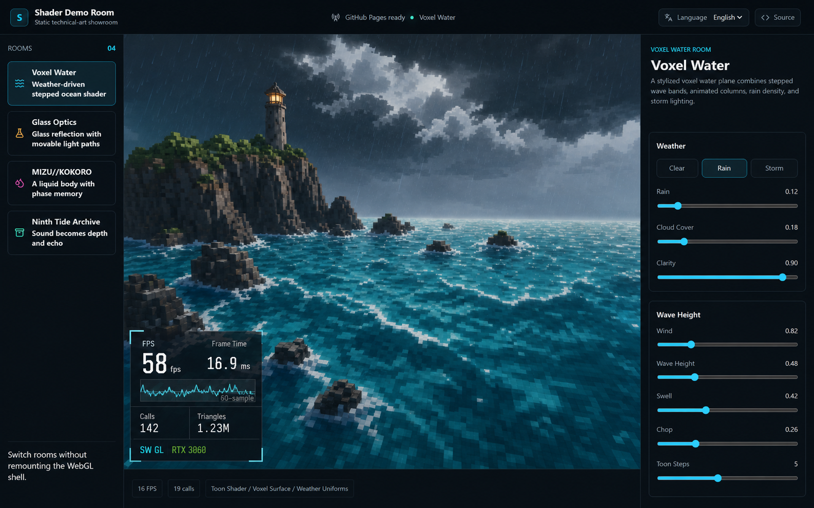
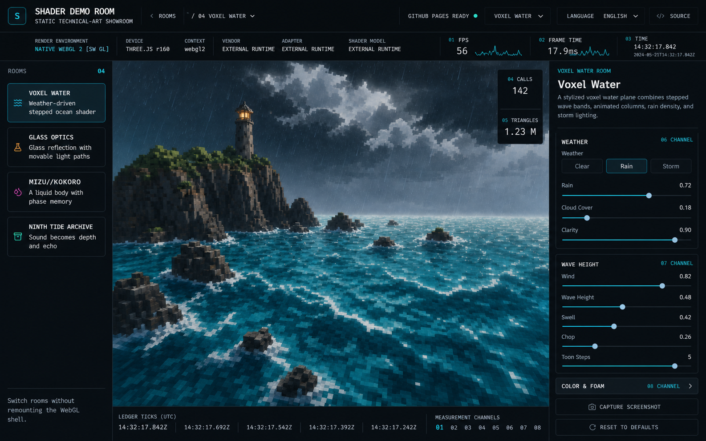

# T-SH-03 telemetry redesign decision

Date: 2026-07-18
Status: approved for implementation

## Design objective

The telemetry surface must read as a calibrated instrument, not a decorative performance promise. It keeps the active exhibit as the visual focus, exposes only values the shell can measure, and makes the renderer environment inseparable from low FPS readings.

## Explored directions

### A — Instrument rail

A full-width strip below the viewport. Cadence and frame time share a restrained sparkline baseline; renderer counters and environment occupy stable cells. This has the clearest hierarchy, does not obscure the artwork, and maps directly to the existing shell-owned telemetry seam.

### B — Corner scope

An L-shaped diagnostic overlay inside the lower-left of the viewport. It has a strong scope identity, but competes with room composition and creates unavoidable overlap risk. The generated reference also demonstrates why renderer classification and renderer name must never be composed into an unchecked marketing-style badge.

### C — Status ledger

A dense top ledger with a right-side measurement stack. It can carry more information, but reduces the exhibit area, duplicates the top bar, and introduces ornamental timestamps and channels that have no product data source.

## Decision

Implement direction A as a bottom **instrument rail**.

- Desktop: five cells for cadence, frame time, draw calls, triangles, and renderer/resources. Cadence and frame time carry the 15-second sparkline. The renderer cell always includes `GPU`, `SW GL`, or `unknown` context.
- Mobile: exactly two measurement cells, cadence and frame time. A compact renderer-context badge remains in the rail header so low values never lose their environment context.
- Embedded exhibits without the T-EMB-02 bridge: one deliberate `External runtime · telemetry unavailable` state instead of zeroes, dashes, or fabricated samples.
- Gizmo, minimap, and camera overlays are not adopted. The current runtime does not expose truthful data for them, they would obscure room composition, and adding those data paths is outside this ticket.

## Visual system

- Reuse the existing semantic shell tokens: `--bg`, `--surface`, `--border`, `--text`, `--muted`, `--accent-cyan`, `--accent-mint`, and `--accent-amber`.
- Reuse `--radius-sm` / `--radius-md`; no radius exceeds 8px.
- Use the system monospace stack for instrument labels and tabular lining numerals for values.
- Keep values neutral. Color communicates renderer/state context, not a universal good/bad FPS grade.
- Redraw the sparkline only when the 4Hz telemetry sample changes. It has no animation and is hidden from the accessibility tree; adjacent text is the accessible equivalent.

## Review criteria

The implementation review must compare 1440×900 and 390×844 captures against this decision, confirm the exhibit is not occluded, confirm mobile has two measurement cells, and reject any metric without a defined source in the telemetry protocol.
