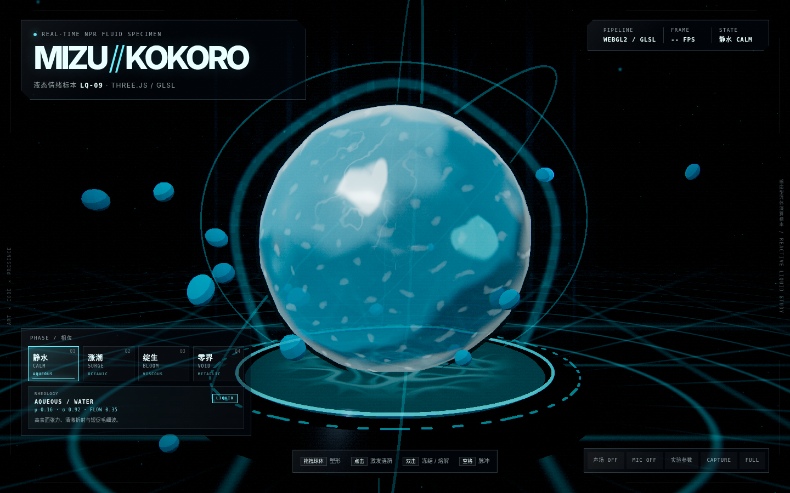
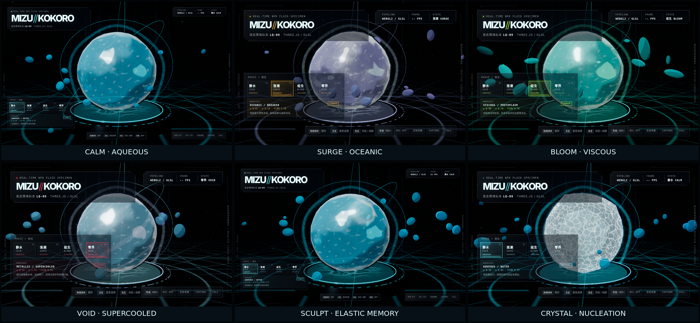

# MIZU//KOKORO 2.0 — 可交互动漫风格化液体生命

Three.js / GLSL 实时渲染技术展品。它把一枚悬浮液体球设定为会响应触碰、流场、声音和相变的“液态情绪标本 LQ-09”。2.0 版重点重构了水感、四种流变主题、表面输运、塑形回弹和冻结晶化。





更多状态画面见 `docs/screenshots/`；完整艺术指导见 [ART_DIRECTION.md](./ART_DIRECTION.md)。

## 运行

需要 Node.js `^20.19.0` 或 `>=22.12.0`。

```bash
pnpm install --frozen-lockfile
pnpm --filter anime-liquid-orb-exhibit dev
```

生产构建：

```bash
pnpm --filter anime-liquid-orb-exhibit build
pnpm --filter anime-liquid-orb-exhibit preview
```

依赖由仓库根目录的 `pnpm-lock.yaml` 精确锁定。`dist/` 是可再生成、不会提交的静态站点；根目录执行 `pnpm exhibits:build` 后，它会连同 `THIRD_PARTY_NOTICES.md` 一起替换发布到 `public/exhibits/anime-liquid-orb/`。请勿直接编辑该 public 目录。

生产构建保留外部 source map：源码已随 fork 公开，map 不承担秘匿职责，也不会被普通页面访问主动下载；保留它可支持线上调试与视觉 QA。

## 2.0 核心升级

### 四套真正不同的流变角色

| 相位 | 材质身份 | 主要物性 | 操作感受 |
|---|---|---|---|
| 静水 CALM | AQUEOUS / WATER | 高清澈、高表面张力、短毛细波 | 迅速弹回、折射清晰 |
| 涨潮 SURGE | OCEANIC / BREAKER | 低黏度、大惯性、强浪涌与泡沫 | 能量传播远、波峰破碎 |
| 绽生 BLOOM | VISCOUS / PROTOPLASM | 高黏度、强剪切、低恢复 | 拉丝、迟滞、形变停留 |
| 零界 VOID | METALLIC / SUPERCOOLED | 低流速、高张力、尖锐回弹 | 硬、快、接近相变阈值 |

每个相位独立控制黏度、张力、浪涌、流速、湍流、泡沫、清澈度、弹性、恢复和剪切，而不是只换颜色。

### 更完整的水体光学

- 场景先写入离屏颜色缓存，液体再进行屏幕空间折射。
- 折射偏移由形变法线、切向流场、视角和清澈度共同决定。
- 背面吸收壳补充体积厚度；RGB 轻微错位形成受控色散。
- 台座使用动态焦散投影；内部悬浮结构和液滴提供视差。
- 波峰泡沫由位移、导数、流线和主题泡沫系数联合生成。

### 表面流场

球面上生成无接缝切向矢量场，并使用两组半周期错位输运避免图案无限拉伸。流线同时参与高光、焦散、泡沫和黏性点色，使表面“在流”，而不是只有几何在抖。

### 晶化状态

双击从命中位置生成晶核，冻结前沿沿球面扩散。冻结态包含：

- 独立低多边形晶体外壳；
- 面法线、量化光照和硬高光；
- cellular 细胞边界、径向裂纹与环裂；
- CPU 生成的内部分叉裂纹；
- 晶片、气泡、色散和局部传播；
- 冻结后的脆性点击反馈。

液态与晶态的差异发生在轮廓、法线、光学、内部结构、时间和交互规则六个层面。

### 塑形与生命力

拖拽被分解为法向隆起、切向剪切、负压肩部和对侧收缩。释放后由二阶弹簧系统产生过冲、切向甩动和传播回弹波；不同主题的黏度与弹性决定恢复方式。

## 交互

| 输入 | 行为 |
|---|---|
| 指针悬停 | 局部预感知与轻微隆起 |
| 按住并拖拽球体 | 法向塑形、切向拉伸、微粒剥离 |
| 松开 | 过冲回弹、释放波和舞台脉冲 |
| 点击球体 | 注入球面涟漪、冲击环和粒子 |
| 双击球体 | 从命中点晶化 / 熔解 |
| 空格 | 全局脉冲 |
| `1`–`4` | 切换四种流变相位 |
| 声场 | 开启程序化低频声场与交互音符 |
| MIC | 以麦克风能量驱动表面、核心和环境 |
| 实验参数 | 形变、速度、描边、辉光、色差、表面流线、回弹活性与质量档位 |
| CAPTURE | 保存当前画面为 PNG |
| FULL / `F` | 全屏 |

麦克风通常要求 HTTPS 或 localhost，并需要浏览器授权。

## 渲染架构

```text
背景 / 舞台 / 粒子
        ↓
离屏折射颜色缓存
        ↓
液体前壳 + 背面吸收壳 + 内部核心
        ↓
可选晶体外壳 / 裂纹 / 晶片
        ↓
RenderPass
→ UnrealBloomPass
→ 自定义调色、色差、颗粒、暗角、海报化
→ SMAA
→ OutputPass
```

主体着色器包含：

- 程序化球面形变；
- 有限差分法线重建；
- 切向流场与双相输运；
- 屏幕空间折射和色散；
- 三段动漫明暗、硬切双高光、菲涅耳边缘；
- 波峰泡沫、表面流线和焦散；
- 局部晶核传播与流动锁定。

这不是 CFD 求解器，而是为了交互可读性和动漫造型组织的实时物理启发系统。折射为单次屏幕空间近似，厚度为视角代理。

## 项目结构

```text
anime-liquid-orb/
├─ index.html
├─ package.json
├─ vite.config.js
├─ src/
│  ├─ main.js
│  └─ style.css
├─ docs/screenshots/
├─ ART_DIRECTION.md
├─ UPGRADE_NOTES.md
└─ dist/
```

## 性能档位

- **HIGH**：较高像素比、完整环境粒子、SMAA、阴影和较高折射缓存分辨率。
- **MID**：降低像素比、环境粒子与折射缓存分辨率。
- **LOW**：像素比 1、关闭 SMAA 与阴影、进一步降低环境粒子和折射缓存；主体形变、表面流场与晶化仍保留。

现场展示应优先锁定输入延迟和稳定帧率，再增加分辨率与后期强度。

## 验证状态

- Vite 生产构建通过。
- Chromium WebGL2 下完成静水、涨潮、绽生、零界、塑形和晶化状态的运行截图验证。
- 晶体着色器首次显现无控制台编译错误。
- 修复加载遮罩透明后仍截获指针的问题，并禁止拖拽时浏览器原生文本选择。
- 软件 SwiftShader 仅用于兼容性回归，其帧率不代表独立 GPU 的实际性能。

## 主要资料

研究来源和设计转译见 [ART_DIRECTION.md](./ART_DIRECTION.md)。Three.js API 以官方文档为准：WebGLRenderer、ShaderMaterial、WebGLRenderTarget、EffectComposer、UnrealBloomPass、SMAAPass、OutputPass 与 OrbitControls。

项目不下载或再分发参考作品的图像、音频、字体或模型；画面资源全部由代码程序化生成。
